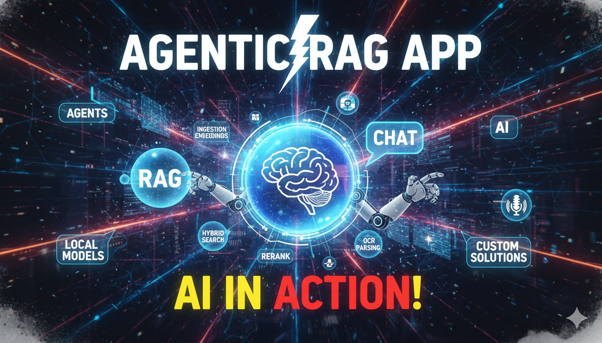

# Agentic RAG Application

A complete agentic RAG system with multi-tenant chat interface, document ingestion pipeline, hybrid search, metadata filtering, LLM-based tool calling, reranking, and subagent delegation capabilities.

[](https://youtu.be/iybjMFp-JdQ?si=BjiJO3fdn7ontHe7)

## Why? What is it for?

This is a complete foundation for building agentic RAG-based chat applications that retrieve precise information from unstructured data sources. It's designed for real-world use cases where organizations need intelligent document retrieval and Q&A systems:

- **Internal knowledge bases** - Corporate documentation, policies, procedures, onboarding materials
- **Customer support systems** - Product documentation, troubleshooting guides, FAQs
- **Research and analysis** - Academic papers, market research, technical reports
- **Legal and compliance** - Contracts, regulations, case law, compliance documents

<details>
<summary><strong>When to use RAG (vector search):</strong></summary>

<br>

- Your data is unstructured (documents, PDFs, manuals, reports)
- Information is scattered across many files
- Questions require semantic understanding, not exact keyword matches
- Content changes frequently (new documents added regularly)

</details>

<details>
<summary><strong>When NOT to use RAG:</strong></summary>

<br>

For structured data sources (codebases, API documentation with organized folders), consider **agentic search** instead. Modern LLMs can efficiently navigate folder structures and table-of-contents files without the overhead of chunking, embedding, and vector search. This approach has less infrastructure complexity and works better when data is already well-organized.

</details>

## Features

- **Multi-tenant chat interface** - User auth, threaded streamed chats, model selection (OpenAI, OpenRouter, local via LM Studio)
- **Document ingestion pipeline** - Multi-format document support, processing status tracking, content hashing + deduplication
- **Advanced RAG pipeline** - Intelligent chunking, embeddings, pgvector storage, metadata filtering, hybrid search, reranking
- **Agentic capabilities** - LLM tool selection (text-to-SQL, web search, retrieval), subagent delegation for complex analysis

## Tech Stack

| Layer | Technology |
|-------|-----------|
| Frontend | React, TypeScript, Vite, Tailwind CSS, shadcn/ui |
| Backend | Python, FastAPI |
| Database | Supabase (Postgres + pgvector + Auth + Storage + Realtime) |
| Document Processing | Docling |
| AI Models | OpenAI, OpenRouter, LM Studio (local) |
| Observability | LangSmith |

## Getting Started

**Complete setup instructions are in [SETUP.md](./SETUP.md)** - including prerequisites, installation, configuration, deployment, and troubleshooting.

**Quick overview:**
- **Prerequisites:** Python 3.10+, Node.js 18+, Supabase account, OpenAI API key
- **Optional:** LangSmith (observability), Cohere (reranking), Tavily (web search), OpenRouter/LM Studio (alternative LLM providers)
- **Setup:** Run database migrations, configure `.env` files, install dependencies
- **Run:** Start backend (`uvicorn main:app --reload`) and frontend (`npm run dev`)
- **Test:** Sign up, create thread, upload documents, start chatting

👉 **[Read SETUP.md for detailed instructions](./SETUP.md)**

## Usage

### Example Queries

The system automatically selects the appropriate tool based on your question:

**Document Retrieval Tool** - Searches your uploaded documents using hybrid search (vector + keyword):
```
"What is the training code for TechFlow training?"
"What is the qubit stability rate in the Zenith project?"
"What is the IT support extension number?"
```

**Text-to-SQL Tool** - Queries the structured books database:
```
"What books were written by J.K. Rowling?"
"List some fantasy genre books from the database."
"Show me all books published after 2010."
```

**Web Search Tool** - Falls back to real-time web search when documents don't have the answer:
```
"What is the current weather in London right now today?"
"What are the latest technology news headlines today?"
"What happened in the tech industry this week?"
```

**Subagent Delegation** - Spawns an isolated subagent with its own context for deep document analysis:
```
"Please analyze the document zetacorp_annual_report.txt and extract the quarterly revenue breakdown with growth rates."
"Analyze project_alpha.txt and extract all the project details."
"Summarize the key findings from research_paper.pdf."
```

The LLM intelligently routes your question to the right tool(s) and can combine multiple tools in a single conversation.

---

<details>
<summary><strong>📚 Documentation</strong></summary>

<br>

- **[PRD.md](./PRD.md)** - Product requirements and detailed module breakdown
- **[CLAUDE.md](./CLAUDE.md)** - Project context for Claude Code (development guidelines)
- **[PROGRESS.md](./PROGRESS.md)** - Build progress tracking and completion status
- **[SETUP.md](./SETUP.md)** - Installation and setup instructions
- **[.agents/plans/](./.agents/plans/)** - Detailed implementation plans for each module
- **[.agents/execution-reports/](./.agents/execution-reports/)** - Post-execution summaries and metrics
- **[.agents/claude-pr-reviews/](./.agents/claude-pr-reviews/)** - Code review feedback from Claude
- **[.agents/system-reviews/](./.agents/system-reviews/)** - Process improvement analysis

</details>

<details>
<summary><strong>🔧 The 8 Modules</strong></summary>

<br>

This application implements all 8 modules from the RAG architecture pattern:

### 1. App Shell
Auth, chat UI, managed RAG with OpenAI Responses API

### 2. BYO Retrieval + Memory
Ingestion, pgvector, switch to generic completions API

### 3. Record Manager
Content hashing, deduplication

### 4. Metadata Extraction
LLM-extracted metadata, filtered retrieval

### 5. Multi-Format Support
PDF, DOCX, HTML, Markdown via Docling

### 6. Hybrid Search & Reranking
Keyword + vector search, RRF, reranking

### 7. Additional Tools
Text-to-SQL, web search fallback

### 8. Subagents
Isolated context, document analysis delegation

</details>

<details>
<summary><strong>⚙️ GitHub Workflows</strong></summary>

<br>

Automated code review and fix workflows for AI-assisted development (located in [`.github/workflows/`](./.github/workflows/)):

- `claude-review.yml` / `claude-fix.yml` - Claude Code integration for PR reviews and fixes
- `codex-review.yml` / `codex-fix.yml` - OpenAI Codex integration
- `cursor-review.yml` / `cursor-fix.yml` - Cursor IDE integration
- `release-notes.yml` - Automated release notes generation

Customize workflow prompts via [`.github/workflows/prompts/`](./.github/workflows/prompts/) to tailor the review and fix processes to your project's needs.

</details>

<details>
<summary><strong>🚀 Future Enhancements</strong></summary>

<br>

Beyond the current implementation, several advanced RAG techniques could further improve retrieval quality and answer accuracy:

### 1. Graph RAG

Graph-based retrieval augmentation creates knowledge graphs from documents to capture relationships and enable multi-hop reasoning. Instead of treating chunks as isolated text snippets, Graph RAG builds entity relationships and semantic connections that improve contextual understanding. Tools like **Microsoft's GraphRAG**, **LlamaIndex's Knowledge Graph Index**, and **Neo4j with LangChain** provide out-of-the-box implementations. This approach excels at answering questions requiring multi-document synthesis or relationship traversal (e.g., "How are these three research papers connected?").

### 2. Extra LLM Passes

Multiple LLM passes can enhance both retrieval precision and answer quality. Examples include:
- **Question generation per chunk**: Store questions each chunk answers well, enabling question-to-question matching during retrieval
- **Answer validation with retries**: Verify the LLM's response against retrieved context, retry with expanded context if confidence is low
- **Web search fallback validation**: Cross-reference answers with real-time web search to detect outdated or contradictory information
- **Multi-agent verification**: Use separate LLM instances to critique and refine answers before presenting to users

These techniques trade latency for accuracy, making them suitable for high-stakes use cases where correctness outweighs speed.

### 3. Advanced Chunking

Current fixed-size chunking (1000 chars with 200 char overlap) is simple but ignores document structure and semantic boundaries. Advanced approaches include:
- **Semantic chunking** (LangChain): Split documents at natural semantic boundaries using embedding similarity to detect topic shifts
- **Hybrid chunking** (Docling): Combine structural parsing (headings, sections) with content-aware splitting to preserve document hierarchy
- **Agentic chunking**: Use LLMs to dynamically determine optimal chunk boundaries based on content density and question patterns
- **Context-preserving chunking**: Prepend section headers or document metadata to each chunk for better standalone comprehension

These methods improve retrieval relevance by ensuring chunks represent coherent, self-contained units of meaning.

</details>

<details>
<summary><strong>⚠️ Known Limitations</strong></summary>

<br>

While all 8 modules have been implemented and core functionality is working, several areas need attention before production deployment:

1. **Metadata-Enhanced Retrieval Not Implemented** - Module 4 extracts and stores document metadata (summary, document_type, key_topics) but the retrieval pipeline does not yet use this metadata for filtering or boosting. Documents are retrieved purely by vector/hybrid search score. Metadata-filtered retrieval (e.g. "search only within PDFs" or "find chunks from documents about finance") is a genuine unimplemented gap.

2. **Provider Settings Not Persisted Across Sessions** - The model provider configuration (chat model, embeddings model) is stored in React in-memory state only (`useModelConfig` hook, `useState`). Settings reset to backend defaults every time the browser is refreshed or a new session starts. There is no backend persistence or localStorage for user provider preferences.

3. **Agentic Flow Refinement** - The LLM's multi-step retrieval flow (triggering document retrieval → subagent analysis) needs further testing and system prompt refinement. Both tools work when invoked separately, but the orchestration pattern requires validation and prompt optimization.

4. **Frontend Enhancements** - Several UX improvements would upgrade the look & feel:
   - Display tool calls in conversation history (collapsible boxes)
   - Persist tool calls as messages in the database
   - Show LLM "thinking" responses in the UI
   - Improve visual feedback for multi-step agentic workflows

5. **Production Hardening** - Additional validation and security updates needed:
   - Comprehensive input validation and sanitization
   - Rate limiting and abuse prevention
   - Error handling and recovery patterns
   - Security audit of RLS policies
   - Performance optimization and caching strategies
   - Monitoring and alerting infrastructure
   - Load testing and scalability validation

</details>

---

## About This Project

This is a complete implementation of the **[Claude Code RAG Masterclass](https://www.youtube.com/watch?v=xgPWCuqLoek)** [](https://www.youtube.com/watch?v=xgPWCuqLoek), built through collaboration with Claude Code. The repository demonstrates the full capabilities of building complex AI applications with AI coding tools.
This is a POC-level implementation demonstrating the full RAG architecture. Use it as a learning resource and reference implementation, but apply production-grade engineering practices before deploying to real users, see 'Known Limitations' above for more info.
